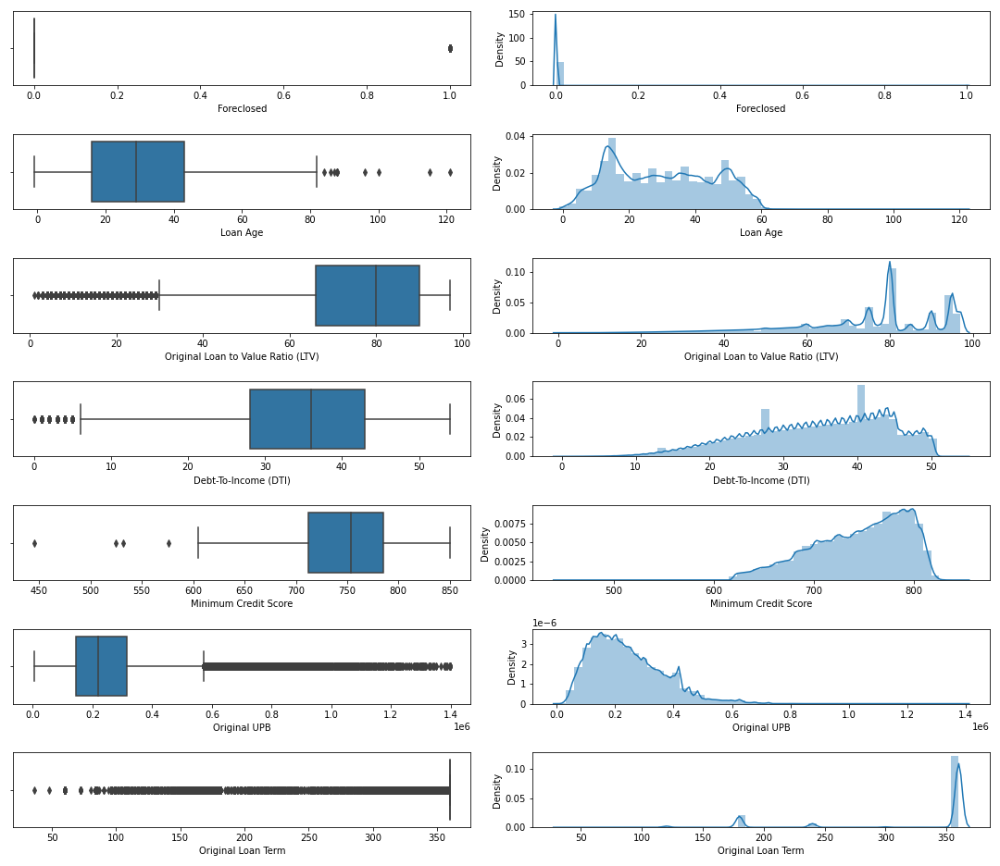
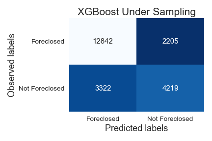
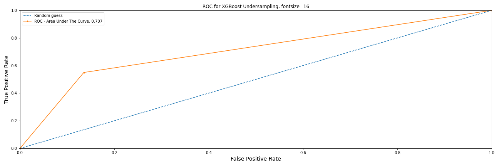
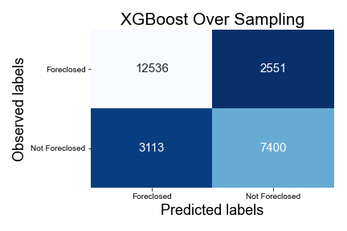
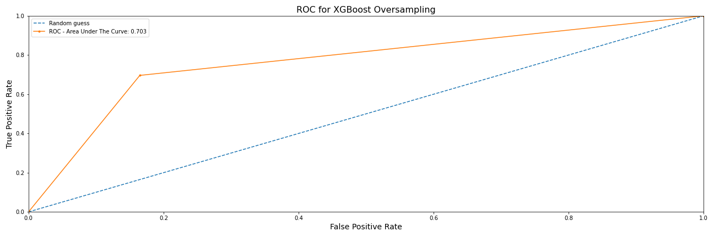

------

[Heroku Deployed Model](https://capstone-classification-app.herokuapp.com/)

# Project Overview

The goal of this project is to analyze the Fannie Mae Single-Family Loan Data.

What question am I trying to answer?
The main question -

1. The purpose is to build a model that can predict if an acquired loan will default or not.

## Where to obtain the data?
All of the data came from Fannie Mae's data housing [website]( https://capitalmarkets.fanniemae.com/tools-applications/data-dynamics), and the data is broken up by quarters from 2000 through 2020. 

## How was the data sampled?
The data used come 2016, 2017, 2018, and 2019.

# Original Data

------

Initially, Fannie Mae has all of its data in CSV format, and the total size is roughly **370Gb**. Each quarter starting from 2000 has about **104 million rows** of data, so altogether that would have required a massive amount of computing power. 

The compiled data had **108** columns; however, most of them were added in 2017 and would not start reporting data until June 2020, so I decided not to use those rows for this project.

------

# Pre-Processing the data

------

> **`Foreclosure`**  has **99.95%** missing data and **`Co-Borrower Credit Score at Origination`** has **52.79%** missing. 

------

## Data Manipulation

1. Created a new column called **`Minimum Credit Score`** by taking comparing the following two columns:

   - Borrow Credit Score at Origination
   - Co-Borrower Credit Score at Origination

   Fannie Mae provided guidelines on creating new features, and with this specific one, I had to look at both columns. If missing values, take the `mean` of that column and enter it for the value; however, if both columns have values, take the lowest of them. 

2. Feature **`On Assistance Plan`** was mapped using the following code snippet:

   ```python
   # F T R to be on plan
   def check_plan(x):
       if x in ['F', 'T', 'R']:
           return 1
       return 0
   ```

3. Dropped the following columns after creating new ones **`Borrower Credit Score at Origination`, `Co-Borrower Credit Score at Origination`,  `Borrower Assistance Plan`**

4. Set new conditions to fill in the null values of **`Foreclosed`** using the following methods:

   ```python
   # df['Current Loan Delinquency Status'] >= 4 and not on df['On Assistance Plan'], foreclosed = 1 (True)
   # create a list of our conditions
   conditions = [
       (df['Current Loan Delinquency Status'] >= 4) &
       (df['On Assistance Plan'] == 0), 
       (df['Foreclosure Date'].notnull())
       ]
   # create a list of the values we want to assign for each condition
   values = [1,1]
   # create a new column and use np.select to assign values to it using our lists as arguments
   df['Foreclosed'] = np.select(conditions, values)
   ```

   with the final output of 

   ```python
   0    8260646
   1      22843
   Name: Foreclosed, dtype: int64
   ```

5. The feature columns  that were dates needed to be strings so we could format them correctly:

   ```Python
   df[['Monthly Reporting Period',
           'Origination Date', 
           'Maturity Date']]  = df[['Monthly Reporting Period',
                                       'Origination Date', 
                                       'Maturity Date']].astype('str')
   ```

   After imputation from float to string, the string retained its '.',  so to resolve this, a new column was created:

   ​		**Origination Date**

   ```python
   # new data frame with split value columns
   df['Origination Date'] = df['Origination Date'].str.split(".", n = 1, expand = True)
   
   df['Origination Date'] = pd.to_datetime(df['Origination Date'],format='%m%Y')
   ```

   ​		**Maturity Date**

   ```python
   # new data frame with split value columns
   df['Maturity Date'] = df['Maturity Date'].str.split(".", n = 1, expand = True)
   
   df['Maturity Date'] = pd.to_datetime(df['Maturity Date'], format='%m%Y')
   ```

   ​		**Monthly Reporting Period**

   ```python
   df['Monthly Reporting Period'] = pd.to_datetime(df['Monthly Reporting Period'],format='%m%Y')
   ```

   Our final shape of the data **(8,278,657, 19)**


------

# Exploratory Data Analysis

------

> *Reviewing the  heatmap, we can see the relationship between all of the features and determine if there will be any collinearity; however, since we are conducting a prediction classification, multi-collinearity will not affect our outcome*


> **This image contains boxplots and distplots of a few features.** We can see that some features include outliers, and we have right-skewed and left-skewed distribution.




------

## Our target feature **Foreclosed** was heavily imbalanced:

<div style="display: flex; justify-content: center">
   
</div>

------


## Imbalanced Data Modeling

Machine learning algorithms work better when the number of samples in each class is about equal.  

- **Majority Class**: The target feature values are **[0]** not foreclosed.
- **Minority Class**: The target features values are **[1]** foreclosed.

Here are some ways to overcome the challenge of imbalanced:

1. **Can we collect more data?**

2. **Change the performance metric.**

   - **Confusion Matrix**: A breakdown of predictions into a table showing correct predictions and the types of incorrect predictions made.
   - ** Precision**: A measure of a classifier's exactness.
   - ** Recall**: A measure of a classifiers completeness
   - **F1 Score (or F-score)**: A weighted average of Precision and Recall.

3. **We can try resampling the dataset**

   1.  Add copies from the under-represented class called over-sampling, or
   2. Delete instances from the over-represented class, called under-sampling
   3. Or we could do both

4. **Generate Synthetic Samples**

   Here is a link to the most popular algorithm called **[SMOTE](https://machinelearningmastery.com/smote-oversampling-for-imbalanced-classification/)** or the Synthetic Minority Oversampling Technique. 
   
   The module works by generating new instances from existing minority cases that you supply as input. This implementation of SMOTE does **not** change the number of majority cases.

------

### Here is an example of what SMOTE is doing:

<div style="display: flex; justify-content: center">
   
</div>
[source](https://oralytics.files.wordpress.com/2019/05/screenshot-2019-05-20-15.34.14.png?w=705)

# Logistic Regression

To create a baseline for all of our modelings, I ran a logistic regression algorithm. It is the simplest of all machine learning algorithms. 

------

##### Logistic Regression Under Sampled

<div style="display: flex; justify-content: center">
   
   
</div>


------

##### SMOTE Logistic Regression Over Sampled

<div style="display: flex; justify-content: center">
   
   
</div>


# Decision Tree

------

##### Decision Tree using Under Sampling Data

<div style="display: flex; justify-content: center">
   
   
</div>
------


##### Decision Tree using Over Sampling Data

<div style="display: flex; justify-content: center">
   
   
</div>

# Random Forest

------

##### Random Forest using Under Sampling Data

<div style="display: flex; justify-content: center">
   
   
</div>
------


##### Random Forest using Over Sampling Data

<div style="display: flex; justify-content: center">
   
   
</div>

# XGBoost

------

##### XGBoost Under Sampling Data

<div style="display: flex; justify-content: center">
   
   
</div>


------

###### Feature Importance




------


##### XGBoost Under Sampling Data

<div style="display: flex; justify-content: center">
   
   
</div>


###### Feature Importance





[Heroku Deployed Model](https://capstone-classification-app.herokuapp.com/)
