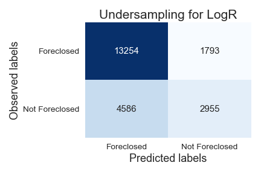

------

[Heroku Deployed Model](https://capstone-classification-app.herokuapp.com/)

# Project Overview

The goal of this project is to analyze the Fannie Mae Single-Family Loan Data.

What question am I trying to answer?

1. The purpose is to build a model that can predict if an acquired loan will default or not.

## Where to obtain the data?
All of the data came from Fannie Mae's data housing [website]( https://capitalmarkets.fanniemae.com/tools-applications/data-dynamics), and is broken up by quarters from 2000 through 2020. 

## The data used?
This project only used the following years: 2016, 2017, 2018, and 2019.

# Original Data

------

Fannie Mae has all of its data in CSV format, and the total size is **370Gb**. Each quarter starting has about **104 million rows**, so altogether that would have required a massive amount of computing power. 

The features for this data add up to**108** columns; however, most of them were added in 2017 and would not start reporting data until June 2020, so I decided not to use those rows for this project.

------

# Pre-Processing the data

------

> **`Foreclosure`**  has **99.95%** missing data and **`Co-Borrower Credit Score at Origination`** has **52.79%** missing. 

------

## Data Manipulation

Created a new column called **`Minimum Credit Score`** by taking the following columns:

- Borrow Credit Score at Origination

- Co-Borrower Credit Score at Origination


Guidelines provided by Fannie Mae state:

- If both columns have data use the lowest score
- If only one column has data use that score
- If neither columns have data take the mean of both and use the lowest score


Feature **`On Assistance Plan`** was mapped using the following code snippet:

```python
# F T R to be on plan
def check_plan(x):
    if x in ['F', 'T', 'R']:
        return 1
    return 0
```

Dropped the following columns after creating new ones **`Borrower Credit Score at Origination`, `Co-Borrower Credit Score at Origination`,  `Borrower Assistance Plan`**

Set new conditions to fill in the null values of **`Foreclosed`** using the following methods:

```python
# df['Current Loan Delinquency Status'] >= 4 and not on df['On Assistance Plan'], foreclosed = 1 (True)
# create a list of our conditions
conditions = [
    (df['Current Loan Delinquency Status'] >= 4) &
    (df['On Assistance Plan'] == 0), 
    (df['Foreclosure Date'].notnull())
    ]
# create a list of the values we want to assign for each condition
values = [1,1]
# create a new column and use np.select to assign values to it using our lists as arguments
df['Foreclosed'] = np.select(conditions, values)
```

with the final output of 

```python
0    8260646
1      22843
Name: Foreclosed, dtype: int64
```

The feature columns  that were dates needed to be strings so we could format them correctly:

```Python
df[['Monthly Reporting Period',
        'Origination Date', 
        'Maturity Date']]  = df[['Monthly Reporting Period',
                                    'Origination Date', 
                                    'Maturity Date']].astype('str')
```

After imputation from float to string, the string retained its '.',  so to resolve this, a new column was created:

​		**Origination Date**

```python
# new data frame with split value columns
df['Origination Date'] = df['Origination Date'].str.split(".", n = 1, expand = True)

df['Origination Date'] = pd.to_datetime(df['Origination Date'],format='%m%Y')
```

​		**Maturity Date**

```python
# new data frame with split value columns
df['Maturity Date'] = df['Maturity Date'].str.split(".", n = 1, expand = True)

df['Maturity Date'] = pd.to_datetime(df['Maturity Date'], format='%m%Y')
```

​		**Monthly Reporting Period**

```python
df['Monthly Reporting Period'] = pd.to_datetime(df['Monthly Reporting Period'],format='%m%Y')
```

Our final shape of the data **(8,278,657, 19)**


------

# Exploratory Data Analysis

------

> *Reviewing the  heatmap, we can see the relationship between all of the features and determine if there will be any collinearity; however, since we are conducting a prediction classification, multi-collinearity will not affect our outcome*


> **This image contains boxplots and distplots of a few features.** We can see that some features include outliers, and we have right-skewed and left-skewed distribution.


------

## Our target feature **Foreclosed** was heavily imbalanced:

<div style="display: flex; justify-content: center">
   
</div>

------


## Imbalanced Data Modeling

Machine learning algorithms work better when the number of samples in each class are the same.  

Here are some ways to overcome the challenge of imbalanced:

**Can we collect more data?**

- At this point this is all the data provided
- We can wait until there is more data from Fannie Mae

**Change the performance metric.**

- **Confusion Matrix**: A breakdown of predictions into a table showing correct predictions and the types of incorrect predictions made.
- **Precision**: A measure of a classifier's exactness.
- **Recall**: A measure of a classifiers completeness
- **F1 Score (or F-score)**: A weighted average of Precision and Recall.

**We can try resampling the dataset**

- Add copies from the under-represented class called over-sampling, or
- Delete instances from the over-represented class, called under-sampling
- Or we could do both

**I decided to generate synthetic samples**

Here is a link to the most popular algorithm called Synthetic Minority Oversampling Technique known as   **[SMOTE](https://machinelearningmastery.com/smote-oversampling-for-imbalanced-classification/)** . 

The module works by generating new instances from existing minority cases that you supply as input. This implementation of SMOTE does **not** change the number of majority cases.

------

### Here is an example of what SMOTE is doing:

<div style="display: flex; justify-content: center">
   
</div>
[source](https://oralytics.files.wordpress.com/2019/05/screenshot-2019-05-20-15.34.14.png?w=705)


# Models

1. **Logistic Regression**
2. **Decision Tree**
3. **Random Forest**
4. **XGBoost**


------


# Logistic Regression

To create a baseline for all of our modelings, I ran a logistic regression algorithm. It is the simplest of all machine learning algorithms. 

------

##### Logistic Regression Under Sampled

<div style="display: flex; justify-content: center">
   
   
</div>


------

# Decision Tree

------


##### Decision Tree using Over Sampling Data

<div style="display: flex; justify-content: center">
   
   
</div>

# Random Forest

------

##### Random Forest using Under Sampling Data

<div style="display: flex; justify-content: center">
   
   
</div>
------


# XGBoost

------

##### XGBoost Under Sampling Data

<div style="display: flex; justify-content: center">
   
   
</div>


------

###### Feature Importance


------


##### XGBoost Under Sampling Data

<div style="display: flex; justify-content: center">
   
   
</div>


###### Feature Importance


[Heroku Deployed Model](https://capstone-classification-app.herokuapp.com/)

------

I would like to thank **Drew Jones** for providing support and being an excellent listener.

**Oswald Vinueza** thank you for answering all my questions and providing direction when needed. 

------

August 2nd app was uploaded to [docker](docker pull rcpena/classification-fnma)

Agust 3rd app was deployed on [AWS](https://gallery.ecr.aws/b8c1q3u4/classification-capstone)

