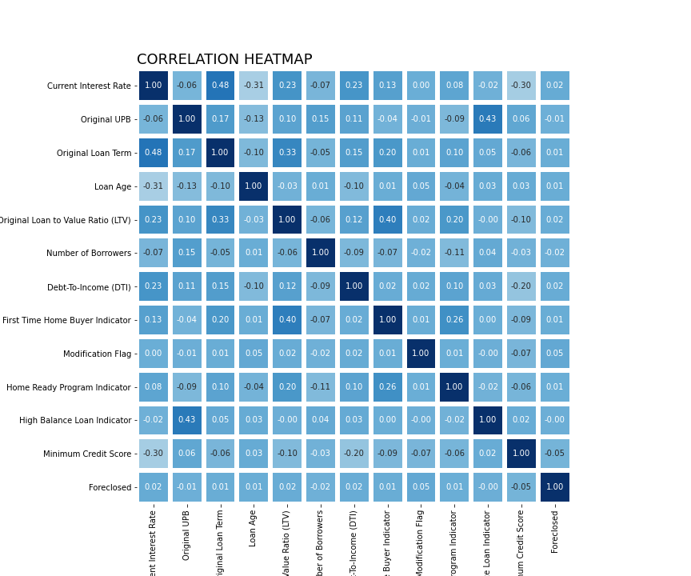
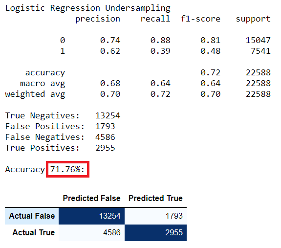
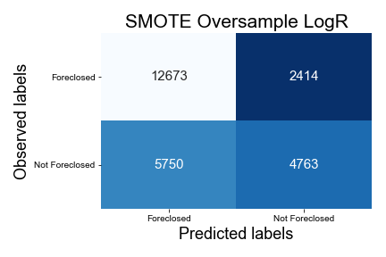
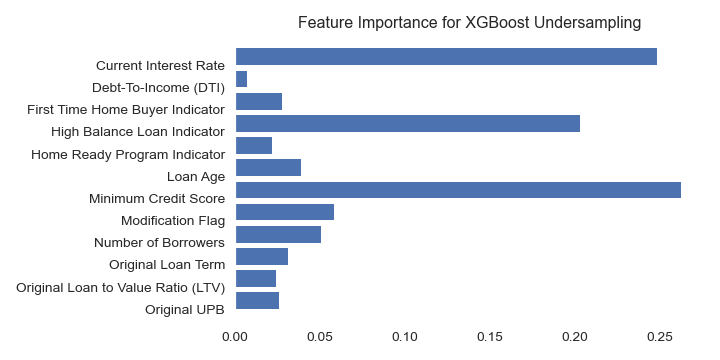

------

## Overview:
The goal of this project is to analyze the Fannie Mae Single-Family Loan Data.

What question am I trying to answer?
The main question -

1. Predict if a loan will be foreclosed on in the future.

## Where did the data come from?
All of the data came from Fannie Mae's data housing [website]( https://capitalmarkets.fanniemae.com/tools-applications/data-dynamics)
The data is broken up by quarters from 2000 through 2020. 

## How was the data sampled?
Data from 2017 to 2019 was used for this project.

## The data pipeline

1. Data Acquisition: Data downloaded from Fannie Mae in .csv format.
2. Data Preprocessing: 
   * Identify missing values and either eliminate those rows or imputation
   * Determine if there are inconsistent values
   * Identify duplicated values
   * Feature aggregation if needed
   * Feature encoding
3. Exploratory Data Analysis:
   * Perform the initial investigations so to discover patterns, spot anomalies, test hypothesis and check assumptions, using visualizations
4. Save our clean file and get ready to start modeling.

# The Original Data

------

Originally, Fannie Mae has all of their data in csv format and the total size is roughly **370gb**. Each quarter starting from 2000 has about **104million rows** of data, so all together that would have required a massive amount of computing power. I decided on using data from 2016 through 2019 for my project. 

The compiled data had **108** columns however, most of them were added in 2017 and would not start reporting reporting data until June 2020, so I decided not use keep those rows for this project.

# Pre-Processing the data

|  #   | Column                                  |  Dtype  |           Null Percentage |
| :--: | :-------------------------------------- | :-----: | ------------------------: |
|  0   | Loan Identifier                         |  int64  |             0 nulls- 0.0% |
|  1   | Monthly Reporting Period                |  int64  |             0 nulls- 0.0% |
|  2   | Original Interest Rate                  | float64 |        **41** nulls- 0.0% |
|  3   | Current Interest Rate                   | float64 |             0 nulls- 0.0% |
|  4   | Original UPB                            | float64 |        **41** nulls- 0.0% |
|  5   | Original Loan Term                      | float64 |             0 nulls- 0.0% |
|  6   | Origination Date                        | float64 |        **41** nulls- 0.0% |
|  7   | Loan Age                                | float64 |             0 nulls- 0.0% |
|  8   | Maturity Date                           | float64 |             0 nulls- 0.0% |
|  9   | Original Loan to Value Ratio (LTV)      | float64 |        **41** nulls- 0.0% |
|  10  | Number of Borrowers                     | float64 |        **41** nulls- 0.0% |
|  11  | Debt-To-Income (DTI)                    | float64 |      **668** nulls- 0.01% |
|  12  | Borrower Credit Score at Origination    | float64 |     **6114** nulls- 0.07% |
|  13  | Co-Borrower Credit Score at Origination | float64 | **4373161** nulls- 52.79% |
|  14  | First Time Home Buyer Indicator         | object  |        **41** nulls- 0.0% |
|  15  | Amortization Type                       | object  |             0 nulls- 0.0% |
|  16  | Current Loan Delinquency Status         |  int64  |             0 nulls- 0.0% |
|  17  | Modification Flag                       | object  |             0 nulls- 0.0% |
|  18  | Foreclosure Date                        | float64 | **8279621** nulls- 99.95% |
|  19  | Home Ready Program Indicator            | object  |             0 nulls- 0.0% |
|  20  | High Balance Loan Indicator             | object  |             0 nulls- 0.0% |
|  21  | Borrower Assistance Plan                | object  |     **4185** nulls- 0.05% |

------

> You can see that **`Foreclosure`**  has **99.95%** missing data and **`Co-Borrower Credit Score at Origination`** has **52.79%** missing. 

## Data Manipulation

The following was completed:

1. Created a new column called **`Minimum Credit Score`** by taking comparing the following two columns:

   - Borrow Credit Score at Origination
   - Co-Borrower Credit Score at Origination

   Fannie Mae provided guidelines on creating new features and with this specific one I had to look at both columns and if anyone was missing I would take the `mean` of that column and enter it for the value, however should both columns have a value only the lowest of the two was kept. 

2. Feature **`On Assistance Plan`** was mapped using the following code snippet:

   ```python
   # F T R to be on plan
   def check_plan(x):
       if x in ['F', 'T', 'R']:
           return 1
       return 0
   ```

3. Dropped the following columns after creating new ones **`'Borrower Credit Score at Origination', 'Co-Borrower Credit Score at Origination',  'Borrower Assistance Plan'`**

4. Set new conditions to fill in the null values of **`Foreclosed`** using the following methods:

   ```python
   # df['Current Loan Delinquency Status'] >= 4 and not on df['On Assistance Plan'], foreclosed = 1 (True)
   # create a list of our conditions
   conditions = [
       (df['Current Loan Delinquency Status'] >= 4) &
       (df['On Assistance Plan'] == 0), 
       (df['Foreclosure Date'].notnull())
       ]
   # create a list of the values we want to assign for each condition
   values = [1,1]
   # create a new column and use np.select to assign values to it using our lists as arguments
   df['Foreclosed'] = np.select(conditions, values)
   ```

   with the final output of 

   ```python
   0    8260646
   1      22843
   Name: Foreclosed, dtype: int64
   ```

5. The feature columns  that were dates needed to be strings so we could format them correctly:

   ```Python
   df[['Monthly Reporting Period',
           'Origination Date', 
           'Maturity Date']]  = df[['Monthly Reporting Period',
                                       'Origination Date', 
                                       'Maturity Date']].astype('str')
   ```

   After imputation from float to string the string retained its '.' ,  so to resolve this a few cells were created:

   ​		**Origination Date**

   ```python
   # new data frame with split value columns
   df['Origination Date'] = df['Origination Date'].str.split(".", n = 1, expand = True)
   
   df['Origination Date'] = pd.to_datetime(df['Origination Date'],format='%m%Y')
   ```

   ​		**Maturity Date**

   ```python
   # new data frame with split value columns
   df['Maturity Date'] = df['Maturity Date'].str.split(".", n = 1, expand = True)
   
   df['Maturity Date'] = pd.to_datetime(df['Maturity Date'], format='%m%Y')
   ```

   ​		**Monthly Reporting Period**

   ```python
   df['Monthly Reporting Period'] = pd.to_datetime(df['Monthly Reporting Period'],format='%m%Y')
   ```

6. Finally, dropped the following null values within these columns:

   ```Python
   Original Interest Rate: total of 41 nulls- 0.0%
   Original UPB: total of 41 nulls- 0.0%
   Original Loan Term: total of 41 nulls- 0.0%
   Origination Date: total of 41 nulls- 0.0%
   Original Loan to Value Ratio (LTV): total of 41 nulls- 0.0%
   Number of Borrowers: total of 41 nulls- 0.0%
   Debt-To-Income (DTI): total of 668 nulls- 0.01%
   First Time Home Buyer Indicator: total of 41 nulls- 0.0%
   Minimum Credit Score: total of 4185 nulls- 0.05%
   Foreclosed: total of 0 nulls- 0.0%
   ```

   Our final shape of the data **(8,278,657, 19)**

# Exploratory Data Analysis

> **Reviewing the  heatmap we can see the relationship between all of the features and determine if there will be any collinearity, however since we are conducting a prediction classification multi-collinearity will not affect our outcome**





> **This image contains boxplots and distplots of a few features.** We can see that there are some features which contain outliers and  we have right and left skewed distribution.


## Our target feature **Foreclosed** was heavily imbalanced:

<div style="display: flex; justify-content: center">
   
   
</div>

## Imbalanced Data Modeling

Machine learning algorithms work better when the number of samples in each class are about equal.  

- **Majority Class**: The target feature values are **[0]** not foreclosed.
- **Minority Class**: The target features values are **[1]** foreclosed.

Here are some ways to overcome the challenge of imbalanced:

1. **Can we collect more data?**

2. **Change the performance metric.**

   - **Confusion Matrix**: A breakdown of predictions into a table showing correct predictions and the types of incorrect predictions made.
   - **Precision**: A measure of a classifiers exactness.
   - **Recall**: A measure of a classifiers completeness
   - **F1 Score (or F-score)**: A weighted average of precision and recall.

3. **We can try resampling the dataset**

   1.  Add copies from the under-represented class called over-sampling, or
   2. Delete instances from the over-represented class, called under-sampling
   3. Or we could do both

4. **Generate Synthetic Samples**

   Here is a link to the most popular algorithm called **[SMOTE](https://machinelearningmastery.com/smote-oversampling-for-imbalanced-classification/)** or the Synthetic Minority Over-sampling Technique. 
   
   The module works by generating new instances from existing minority cases that you supply as input. This implementation of SMOTE does **not** change the number of majority cases.

### Here is an example of what SMOTE is doing:

<div style="display: flex; justify-content: center">
   
</div>
[source](https://oralytics.files.wordpress.com/2019/05/screenshot-2019-05-20-15.34.14.png?w=705)

> **Another example of how SMOTE works behind the scenes**


# Logistic Regression

To create a baseline for all of our modeling I ran a logistic regression algorithm. It is the most simplest of all machine learning algorithms. 

#### #Logistic Regression Under Sampled

<div style="display: flex; justify-content: center">
   
   
</div>


##### SMOTE Logistic Regression Over Sampled

<div style="display: flex; justify-content: center">
   
   
</div>


# Decision Tree

##### Decision Tree using Under Sampling Data

<div style="display: flex; justify-content: center">
   
   
</div>

##### Decision Tree using Over Sampling Data

<div style="display: flex; justify-content: center">
   
   
</div>

# Random Forest

##### Random Forest using Under Sampling Data

<div style="display: flex; justify-content: center">
   
   
</div>

##### Random Forest using Over Sampling Data

<div style="display: flex; justify-content: center">
   
   
</div>

# XGBoost

##### XGBoost Under Sampling Data

<div style="display: flex; justify-content: center">
   
   
</div>

##### XGBoost Over Sampling Data

<div style="display: flex; justify-content: center">
   
   
</div>


### First thing I did was combine an over and under sampling technique by importing the library imblearn

```python
# example of random oversampling to balance the class distribution
# Combining Random Oversampling and Undersampling
counter = Counter(y)
# summarize class distribution
print(f'  Initial Data: {counter}')

# define undersampling strategy
under = rus(sampling_strategy=0.5)
count_y = Counter(y_under)
# fit and apply the transform
X_under, y_under = under.fit_resample(X, y)
# summarize class distribution
print(f'Under sampling: {count_y}')

# define oversampling strategy
over = SMOTE(sampling_strategy=0.7)
# fit and apply the transform
X_over, y_over = over.fit_resample(X_under, y_under)
# summarize class distribution
counter_o = Counter(y_over)
print(f' Over sampling: {counter_o}')
```

Output: 

```python
  Initial Data: Counter({0: 8255841, 1: 22816})
Under sampling: Counter({0: 45632, 1: 22816})
 Over sampling: Counter({0: 45632, 1: 31942})
```

I chose to do the following models:

- Logistic Regression with Under Sampling data
- SMOTE Logistic Regression with Over Sampling data
